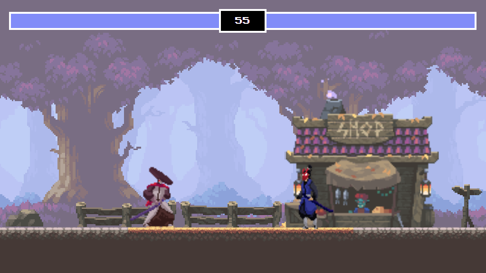

<div align="center">

# Samurai FightingJS!
> A simple fight game made with Javascript!

<div>
  
</div>

[Play now!](https://lucasalvaresa.github.io/samurai-fightingjs/) 
 
 


## Controls for player 1

```sh
  A - Moves backwards
  W - Jump
  D - Moves forward  
  SpaceBar - Attack
```

## Controls for player 2

```sh
  ArrowsLeft - Moves forward
  ArrowsUp - Jump 
  ArrowsRight - Moves backwards  
  ArrowDown - Attack
```
   

</div>